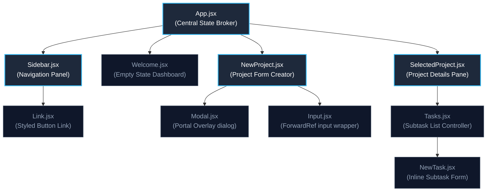

# ⛩️ Yūgen (幽玄) Workspace

[](https://react.dev/)
[](https://vitejs.dev/)
[](https://tailwindcss.com/)
[](https://opensource.org/licenses/MIT)
[](#architecture-discussion-prop-drilling-vs-state-management)

> **"Plan. Organize. Achieve."** 
> A sleek, minimalist project management application constructed during my React learning journey to master foundational patterns, state manipulation, and CSS animations.

---

## 📋 Table of Contents
1. [Overview & Design Aesthetics](#-overview--design-aesthetics)
2. [Architecture & Component Hierarchy](#%EF%B8%8F-architecture--component-hierarchy)
3. [Key React Engineering Concepts](#-key-react-engineering-concepts)
4. [Tailwind CSS Styling & Micro-Animations](#-tailwind-css-styling--micro-animations)
5. [Directory Structure](#%EF%B8%8F-directory-structure)
6. [Architecture Discussion: Prop Drilling vs. State Management](#-architecture-discussion-prop-drilling-vs-state-management)
7. [Installation & Local Deployment](#-installation--local-deployment)

---

## 🎨 Overview & Design Aesthetics

**Yūgen Workspace** is a fluid, front-end-only project planner designed with a contemporary Zen-inspired design system. 

### Core Features
*   **Dynamic Workspaces:** Seamlessly create new projects with titles, markdown-compatible descriptions, and targeting due dates.
*   **Milestone tracking:** Add objectives and micro-tasks per project to establish action-oriented timelines.
*   **Intuitive Navigation:** Interactive sidebar navigation indicating active selection states.
*   **Inline Validation:** Intercepts invalid input sets with overlay dialogue sheets.

### Aesthetic System
*   **Palette:** Designed using HSL-based slate backdrops (`bg-slate-50`), deep navy containers (`bg-blue-950`), and crimson accents (`text-rose-700`).
*   **Typography:** Strict sans-serif typography scales with geometric letter spacing (`tracking-tight`) to ensure immediate legibility.

---

## 🗂️ Architecture & Component Hierarchy

To understand how data flows across the client layout, here is the runtime component topology:



---

## ⚙️ Key React Engineering Concepts

During the implementation of this application, I explored several advanced Hooks and APIs in React:

### 1. Refs Forwarding (`forwardRef`)
To maintain encapsulations while keeping custom form inputs highly reusable, the `Input` component forwards its internal DOM node ref using `forwardRef`. This enables `NewProject.jsx` to collect user values directly from the child input fields on demand:
```javascript
const Input = forwardRef(function Input({ textArea, label, ...props }, ref) {
  return (
    <p className="flex flex-col gap-1.5 mb-5">
      <label className="text-xs font-bold uppercase tracking-wide text-slate-600">{label}</label>
      {textArea ? (
        <textarea ref={ref} className="..." {...props} />
      ) : (
        <input ref={ref} className="..." {...props} />
      )}
    </p>
  );
});
```

### 2. Imperative APIs (`useImperativeHandle`)
In the overlay warning system (`Modal.jsx`), instead of rendering modals conditionally using conditional statements, I used `useImperativeHandle` alongside `forwardRef`. This pattern allows parent components to control UI-critical actions (like opening the native HTML5 `<dialog>` component) cleanly through ref pointers:
```javascript
useImperativeHandle(ref, () => {
    return {
        open() {
            if (dialogRef.current) {
                dialogRef.current.showModal();
            }
        }
    };
});
```

### 3. Rendering via Portals (`createPortal`)
To guarantee that the alert modal is never trapped inside overflow settings (`overflow-hidden`) or constrained by parent `z-index` contexts, I injected the dialog window directly into the root level of the DOM (`#modal-root` inside `index.html`) using React Portals.
```javascript
return createPortal(
    <dialog ref={dialogRef} className="...">
        {/* Modal content */}
    </dialog>, 
    document.getElementById('modal-root')
);
```

---

## ⚡ Tailwind CSS Styling & Micro-Animations

The layout relies on utility-first CSS classes to implement interactive feedback and modern transitions:

*   **Micro-Transitions:** Navigation items change style properties on pointer hover (`hover:-translate-y-0.5 hover:scale-[1.02] transition-all duration-300`).
*   **Overlay Blurs:** The dialog background utilizes Backdrop Blurs (`backdrop:bg-slate-900/60 backdrop:backdrop-blur-sm`) to lock focus onto warning actions.
*   **Viewport Constraints:** The primary navigation sidebar utilizes full viewport-height locks (`h-screen overflow-y-auto`) to support arbitrary lists of workspace files.

---

## 📂 Directory Structure

Here is a visual map of the source layout:

```text
project-management-app-frontend/
├── public/                     # Static media files (logos, backgrounds)
├── src/
│   ├── assets/                 # Brand illustrations
│   ├── components/             # Reusable UI components
│   │   ├── Input.jsx           # Ref-forwarded customized form input
│   │   ├── Link.jsx            # Dynamic navigation anchor button
│   │   ├── Modal.jsx           # Portalled modal component using imperative handle
│   │   ├── NewProject.jsx      # Creation form orchestrator
│   │   ├── NewTask.jsx         # Sub-task creation line
│   │   ├── SelectedProject.jsx # Details layout pane
│   │   ├── Sidebar.jsx         # Sidebar navigation
│   │   ├── Tasks.jsx           # Render controller for milestone items
│   │   └── Welcome.jsx         # Welcome dashboard
│   ├── App.css                 # Base overrides
│   ├── App.jsx                 # App controller & central state broker
│   ├── index.css               # Tailwind directives
│   └── main.jsx                # DOM Entry point
├── index.html                  # HTML entry point (contains #modal-root)
├── vite.config.js              # Bundler specifications
└── package.json                # Project dependencies
```

---

## 🧩 Architecture Discussion: Prop Drilling vs. State Management

This project is configured as a **client-side front-end-only system** that maintains application state in memory. 

### Why Prop Drilling?
As an educational exercise, I intentionally chose to manage state through parent-to-child prop passing (**prop drilling**). The state fields (`projects`, `tasks`, and `selectedProjectId`) reside inside the parent component `App.jsx`. Operations on tasks (e.g. `handleAddTask`, `handleDeleteTask`) are declared at the root level and passed down layers:

$$\text{App.jsx} \longrightarrow \text{SelectedProject.jsx} \longrightarrow \text{Tasks.jsx} \longrightarrow \text{NewTask.jsx}$$

### Insights Gained
*   **Traceability:** Data flow is highly explicit. There are no hidden mutations or background update loops, making small-scale debugging intuitive.
*   **The Tipping Point:** As features grow, intermediate components (like `SelectedProject.jsx`) become simple dispatch agents, carrying data down layers without actually reading or modifying the values themselves.
*   **Moving Forward:** In a production application, this codebase would benefit from state container solutions like **React Context API**, **Zustand**, or **Redux**, which would decouple the view layer from business-state routing. Experiencing this overhead firsthand has provided me with a deep appreciation for those tools.

---

## 🚀 Installation & Local Deployment

To run this project locally, make sure you have [Node.js](https://nodejs.org/) installed:

1.  **Clone the Repository:**
    ```bash
    git clone https://github.com/your-username/project-management-app.git
    cd project-management-app/project-management-app-frontend
    ```

2.  **Install Dependencies:**
    ```bash
    npm install
    ```

3.  **Run Development Server:**
    ```bash
    npm run dev
    ```

4.  **Open Local Host:**
    Navigate to `http://localhost:5173` in your browser.
